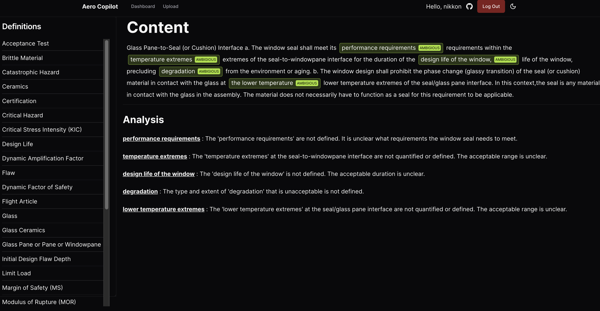
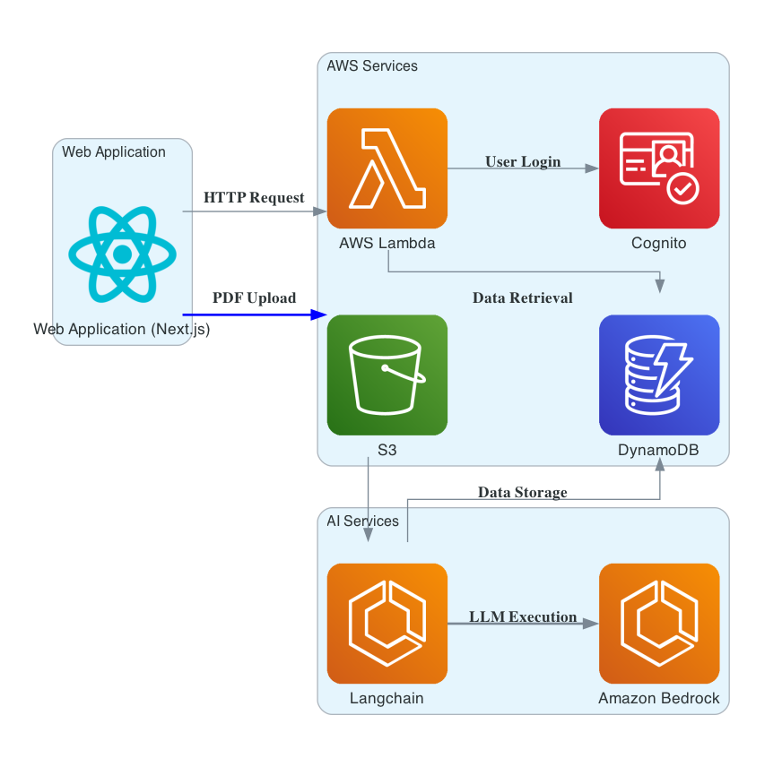

# Aero CoPilot
2023 NASA International Space Apps Challenge

## Final Output

## Premise
In the aeronautics industry, a successful launch and project can represent a growth in reputation, innovation and gives an edge over others if the spacecraft is state of the art. However, failed launches and projects are equally detrimental. For small satellite projects, there has been a 41.3% failure rate for small-satellite projects over the course of 16 years, with a 24.2% total failure rate, 11% partial failure rate and a 6.1% launch failure rate[1]. Considering the rate is that high, all of us should try to limit this to a more reasonable rate, close to zero. But, there is a significant question that should be answered: How can we achieve a near zero percent failure rate? Well, we need to look at one of the main reasons why one can fail.

For example, the propulsion system is a major contributor in the amount of failures, with the feeding system being responsible for around 65% of total propulsion failures[2]. We need to look up Section 6 of the NASA-STD-5012B to look at the standards for some pressurized parts of the system, like hydraulic pumps, bellows and combustion chambers. While the section is mostly clear, terms like “MDC loads” and “FOS” can be very ambiguous without context. As a result, many will fail unless they look up what it means, which wastes time and money on what matters most: making a successful launch. We, a group of six coders from Toronto, are here to introduce a new solution using the power of artificial intelligence (AI) and large language models (LLMs) to make building and testing a spacecraft easier for technicians by correcting and simplifying standards: the Aero CoPilot.

## Introduction
The Aero CoPilot is a state-of-the-art document processing system backed by AI that streamlines and corrects technical documents so that NASA technicians can save time reading through documentation and focus on launching a successful spacecraft. This README file will serve as a comprehensive guide on how to use the tool. There will also be a brief overview of the product, how to set it up, a look at the functionality of the system and a roadmap. 

## Table of Contents

- [System Overview](#system-overview)
- [Getting Started](#getting-started)
- [User Guide](#user-guide)
- [System Functionality](#system-functionality)
- [Contributing](#contributing)
- [Special Thanks](#special-thanks)

## System Overview
Aero CoPilot’s system architecture is built using a microservices architecture using Amazon Web Services (AWS), LangChain and OpenAI. The system architecture is as follows:

From a Next.js Web Application, an HTTP request is thrown to AWS Lambda, where technician sign-up and verification is provided by AWS Cognito and the profile is then stored using DynamoDB. Once a technician uploads a PDF in the website, it gets transferred to an AWS S3 bucket, parses the document via AWS Textract, then it goes through two prompts via LangChain and OpenAI. The first prompt scrapes all technical keywords, phrases and concepts for checking if a term is ambiguous, then it compares with another DynamoDB database with definitions. The remaining terms are then checked with a second prompt, to see if the words can be clarified further based on the context given in the paragraph.

## Getting Started

To get started with Aero CoPilot, follow these steps:

1. Clone the repository to your local machine.
2. Install the necessary dependencies as outlined in the project documentation. For this project, you'll need an AWS account, Python and Node.js.
3. Set up your AWS Credentials.
4. Install the packages that are going to be used in the project.
5. Configure AWS services and environmental variables.

You can now create an account and import a PDF to Aero CoPilot

## User Guide

- User Registration and Login: Users can securely register and log in using AWS Cognito.
- Uploading PDFs: Upload PDF documents via the user-friendly web interface.
- Document Processing: AI-powered processing extracts text and generates suggestions.
- Reviewing Suggestions: Users review and accept suggestions for document improvements.
- Approval Workflow: An automated workflow, provided by AWS Step Functions, tracks and manages suggestion approval.

## System Functionality

- PDF Ingestion: PDF documents are ingested into AWS S3 bucket and processed using Amazon Textract.
- AI Document Analysis: Textract analyzes technical PDFs, extracting content and identifying areas for improvement.
- Suggestion Generation: Custom algorithms analyze Textract results to generate document improvement suggestions.
- Workflow Automation: AWS Step Functions automate suggestion approval workflows.

## Contributing

Contributions to Aero CoPilot are welcome and appreciated. If you would like to contribute, please follow the guidelines outlined in the CONTRIBUTING.md file.

## License

Aero CoPilot is licensed under the MIT License. Please review the license file for more information about the permissions and limitations it provides.

## Special Thanks

* [NASA](https://www.nasa.gov/)
